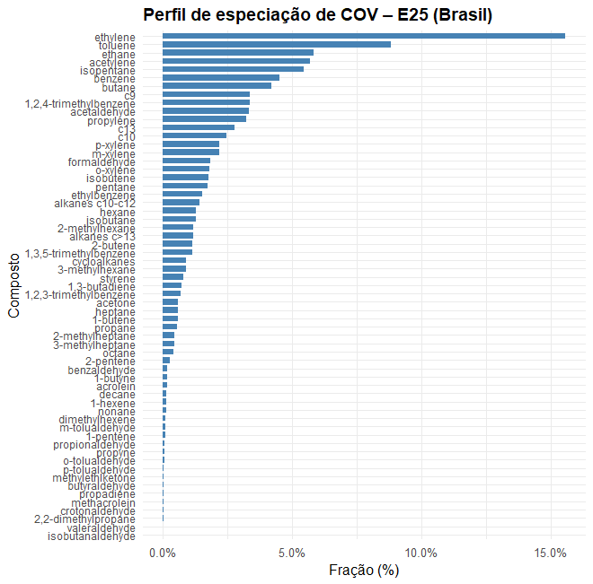

## Sobre este repositório
Este repositório contém informações adicionais dos perfis de especiação química.

## Perfil E25 exaustão - BR
Esse perfil está incorporado no modelo VEIN. 

Tabela 1 - Especiação do perfil E25 - exaustão.
| Composto                  | Fração |
| ------------------------- | -------- |
| ethane                    | 0.0585146079 |
| propane                   | 0.0054610951 |
| butane                    | 0.0420377056 |
| isobutane                 | 0.0127557160 |
| pentane                   | 0.0172482952 |
| isopentane                | 0.0546329723 |
| hexane                    | 0.0129161653 |
| heptane                   | 0.0059366225 |
| octane                    | 0.0042519053 |
| 2-methylhexane            | 0.0118732451 |
| nonane                    | 0.0012835941 |
| 2-methylheptane           | 0.0045728039 |
| 3-methylhexane            | 0.0091456077 |
| decane                    | 0.0015242680 |
| 3-methylheptane           | 0.0043321300 |
| alkanes c10-c12           | 0.0141195347 |
| alkanes c>13              | 0.0116325712 |
| 2,2-dimethylpropane       | 0.0001764333 |
| cycloalkanes              | 0.0091456077 |
| ethylene                  | 0.1556866853 |
| propylene                 | 0.0323707124 |
| propadiene                | 0.0004011231 |
| 1-butene                  | 0.0058563979 |
| isobutene                 | 0.0178098676 |
| 2-butene                  | 0.0113918973 |
| 1,3-butadiene             | 0.0073004412 |
| 1-pentene                 | 0.0008824709 |
| 2-pentene                 | 0.0027276374 |
| 1-hexene                  | 0.0013638187 |
| dimethylhexene            | 0.0012033694 |
| 1-butyne                  | 0.0016847172 |
| propyne                   | 0.0006417970 |
| acetylene                 | 0.0571122195 |
| formaldehyde              | 0.0183232195 |
| acetaldehyde              | 0.0332732236 |
| acrolein                  | 0.0016741870 |
| benzaldehyde              | 0.0018953689 |
| crotonaldehyde            | 0.0003208985 |
| methacrolein              | 0.0004011231 |
| butyraldehyde             | 0.0004175139 |
| isobutanaldehyde          | 0.0000000000 |
| propionaldehyde           | 0.0008104375 |
| valeraldehyde             | 0.0001109735 |
| o-tolualdehyde            | 0.0005615724 |
| m-tolualdehyde            | 0.0010429202 |
| p-tolualdehyde            | 0.0004813478 |
| acetone                   | 0.0059980871 |
| methylethlketone          | 0.0004175139 |
| toluene                   | 0.0880866426 |
| ethylbenzene              | 0.0151624549 |
| m-xylene                  | 0.0217809868 |
| p-xylene                  | 0.0217809868 |
| o-xylene                  | 0.0181307661 |
| 1,2,3-trimethylbenzene    | 0.0068993181 |
| 1,2,4-trimethylbenzene    | 0.0337745688 |
| 1,3,5-trimethylbenzene    | 0.0113918973 |
| styrene                   | 0.0081026875 |
| benzene                   | 0.0450060168 |
| c9                        | 0.0337745688 |
| c10                       | 0.0246289611 |
| c13                       | 0.0277577216 |

